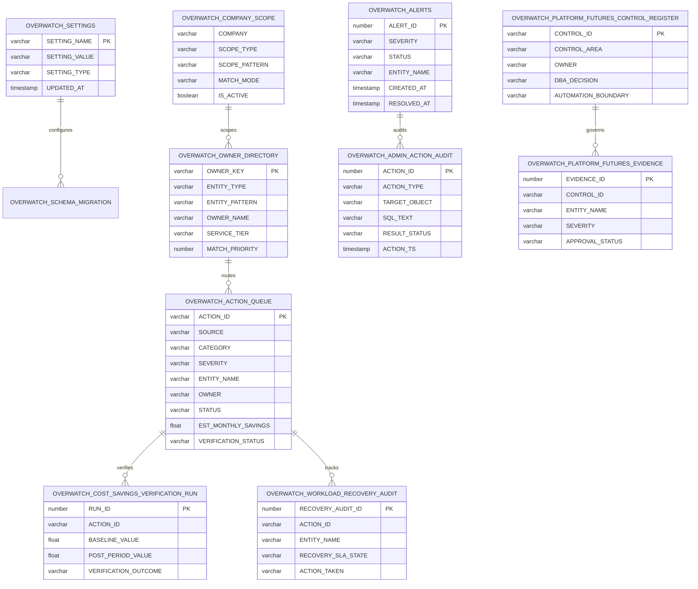

# OVERWATCH Data Model

## Entity Relationship Diagram



## Dynamic Tables (Pre-computation Layer)

| Dynamic Table | Source | Lag | Purpose |
|--------------|--------|-----|---------|
| DT_DAILY_CREDITS | WAREHOUSE_METERING_HISTORY | 1h | Daily cost per warehouse |
| DT_HOURLY_PRESSURE | WAREHOUSE_METERING_HISTORY | 30min | Hourly warehouse utilization |
| DT_TASK_SUMMARY | TASK_HISTORY | 1h | Task success/failure rollup |
| DT_SERVICE_COSTS | METERING_HISTORY | 2h | All service type costs |
| DT_QUERY_BOTTLENECKS | QUERY_HISTORY | 1h | p95 latency, spill, queue |
| DT_STORAGE_TREND | STORAGE_USAGE | 6h | Storage growth over 90 days |

## App-Facing Views

All app queries should read from `V_OVERWATCH_*` views, which abstract
whether the underlying data comes from Dynamic Tables (when deployed)
or live ACCOUNT_USAGE queries (fallback).

## Data Flow

```
SNOWFLAKE.ACCOUNT_USAGE (raw) 
    → Dynamic Tables (pre-aggregated, 30min-6h lag)
        → V_OVERWATCH_* views (stable interface)
            → utils/query.py run_query() (tiered caching)
                → Shell pre-computed metrics (scalars in session state)
                    → UI rendering (instant, no DB access)
```
